# La Forge Watch

La Forge Watch is an internal watch-capitalisation project.
Its goal is to collect useful links shared in La Forge Slack channels, centralise them in Airtable, and prepare them for future search, enrichment and synthesis.

The project is currently linked to the Lapin backlog feature:

> Collecte automatique de la veille Slack
> En tant que forgeron souhaitant capitaliser la veille interne, je veux que Lapin collecte automatiquement les liens partagés dans les canaux Slack de veille, afin de centraliser les ressources utiles, faciliter leur recherche et préparer leur analyse.

---

## 1. Why this project exists

Useful resources are frequently shared in Slack channels: AI news, technical articles, product references, design resources, business insights, etc.

Today, these resources are difficult to find again because they remain scattered across Slack conversations.

La Forge Watch aims to turn these shared links into a structured internal knowledge base.

In short:

```text
Slack watch messages → Airtable database → future search, filtering, enrichment and synthesis
```

---

## 2. Current workflow

```mermaid
flowchart LR
    A[Slack watch channels] --> B[OVH deployed collector]
    B --> C[Collect messages with links]
    C --> D[Save raw records in Airtable]

    D --> E[Experimental notebook]
    E --> F[Read collected links]
    F --> G[Scrape web content]
    G --> H[Summarise and tag]
    H --> I[Prepare enriched watch database]

    I --> J[Future Lapin usage]
```



---

## 3. What has been done

### Step 1 · Slack watch collection

A Slack bot has been configured to read selected public watch channels.

It collects messages containing links and keeps the main contextual information:

* link;
* original Slack message;
* date;
* channel;
* author;
* thread replies, when available;
* reactions, when available.

---

### Step 2 · Airtable centralisation

Collected Slack messages are saved into Airtable.

Airtable is used as the first centralised watch database, making the collected resources easier to:

* browse;
* search;
* filter;
* enrich manually;
* reuse later.

---

### Step 3 · OVH deployment

The Slack → Airtable collector has been deployed on OVH.

The deployed app can run the collection process without requiring manual notebook execution.

The collection is incremental: the system avoids reprocessing the full Slack history every time and focuses on newly shared content.

---

### Step 4 · Link enrichment experiment

A notebook experiment has been created to go further than raw collection.

The notebook tests whether collected links can be automatically processed and enriched with:

* extracted webpage or PDF content;
* generated title;
* short summary;
* key points;
* tags such as resource type, concept, topic and sub-topic.

This part is still experimental and should not yet be considered a production feature.

---

## 4. Current status

| Area                     |        Status | Comment                            |
| ------------------------ | ------------: | ---------------------------------- |
| Slack message collection |          Done | Deployed and connected to Airtable |
| Airtable raw database    |          Done | Centralises collected Slack links  |
| Incremental collection   |          Done | Avoids full reprocessing           |
| Link summarisation       | In experiment | Tested in notebook                 |
| Automatic tagging        | In experiment | Based on keywords and LLM logic    |
| Lapin integration        |   Future step | Not yet productised                |

---

## 5. What this enables

La Forge Watch can become the first layer of an internal watch memory.

Possible uses:

* finding old references shared in Slack;
* preparing internal watch summaries;
* building topic-based resource collections;
* feeding Lapin with reusable knowledge;
* supporting product, commercial or R&D reflections.

---

## 6. Current limits

The current version is useful but still limited.

Known limits:

* only selected Slack channels are covered;
* private channel management is not part of V1;
* duplicated links may still require stronger control;
* web scraping can fail on protected, paywalled or JavaScript-heavy websites;
* LLM-generated summaries need quality control;
* failed enrichment should be clearly flagged for manual review.

---

## 7. Possible next steps

Recommended next steps:

1. Stabilise the Airtable structure for raw and enriched resources.
2. Add a review status such as `new`, `processed`, `failed`, `manual_review`.
3. Improve duplicate detection.
4. Decide whether the enrichment notebook should become a deployed service.
5. Add a simple search and filtering layer for internal users.
6. Connect the watch database to future Lapin features.
7. Later, test automatic weekly summaries or thematic digests.

---

## 8. V1 scope

Included in V1:

* collect Slack messages containing links;
* store them in Airtable;
* keep basic context;
* run incrementally;
* experiment with link enrichment.

Not included in V1:

* full automatic synthesis;
* advanced classification;
* publication to other platforms;
* private channel rights management;
* production-grade scraping infrastructure.

---

## 9. Repository orientation

```text
deploy/
```

Contains the deployed Slack → Airtable collector.

```text
notebook/
```

Contains the experimental Airtable link enrichment notebook.

```text
README.md
```

Provides the product-level project overview and current status.
